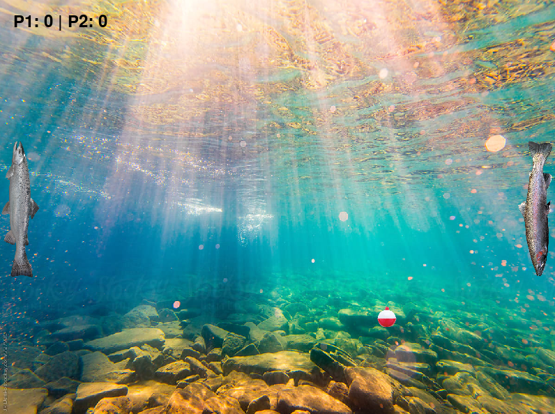
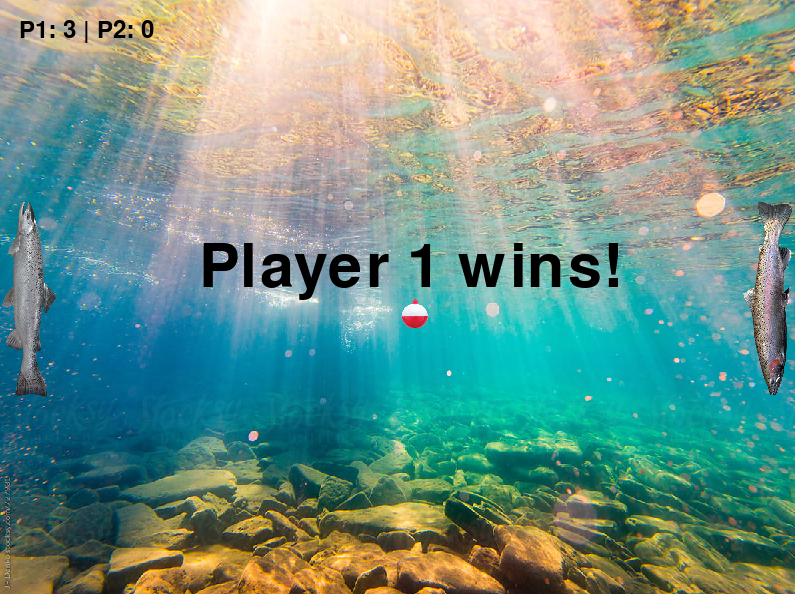

# 🎣The Fishing-Pong 🐟🏓

## Description🐠

The Fishing-Pong is a simple 2D arcade game built using the Pygame library in Python. It is a variation of the classic Pong game with a fishing theme. Players control fish paddles to reflect a bouncing ball, representing a fishing bobber. The objective is to prevent the ball from passing behind the paddle, similar to the traditional Pong game. The game ends when one player reaches a score of three points.

## Features🐍

- **Two-player gameplay:** Players control paddles using keyboard controls.
- **Graphics:** Includes images for the paddles, ball, and background to fit the fishing theme.
- **Score tracking:** Keeps track of the score for each player and displays it on the screen.
- **Game end screen:** Displays a win message when one player reaches three points.

## How to Play🎮

- Player 1: w/s
- Player 2: ↑/↓
- The objective is to prevent the ball from passing behind the paddle.
- Each time the ball passes behind a paddle, the opposing player earns a point.
- The game ends when one player reaches a score of three points.

## Installation💻

1. Clone the repository or download the files.
2. Make sure you have Python installed on your system.
3. Install the Pygame library using pip: `pip install pygame`.
4. Run the `the_fishing_pong.py` file in the `src` directory using Python: `python the_fishing_pong.py`.

## Images📸

## Dependencies📚

- Python 3.12.3
- Pygame

## Sources🌐
- 🐍 Pygame Documentation  -----------------  https://www.pygame.org/docs/
- ▶️ Make Pong With Python!  ---------------  https://www.youtube.com/watch?v=vVGTZlnnX3U
- ▶️ Pygame Loading Images  ----------------  https://www.youtube.com/watch?v=rHEnZfq_zEQ
- 😴 Using time.sleep()  -------------------  https://www.digitalocean.com/community/tutorials/python-time-sleep

## Important Links🔗
- Github: https://github.com/natzambrano/finalproject
- Youtube: 
